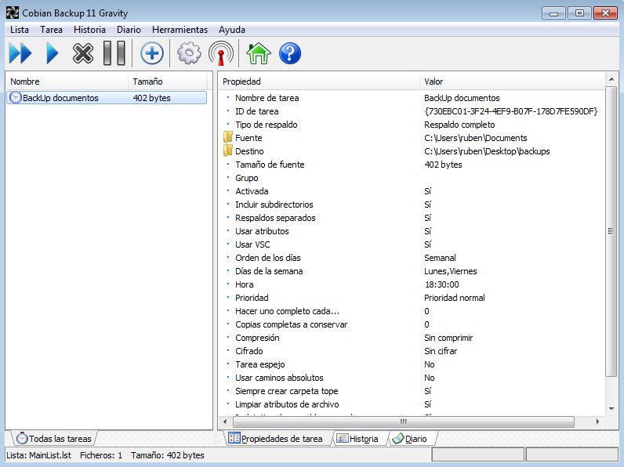
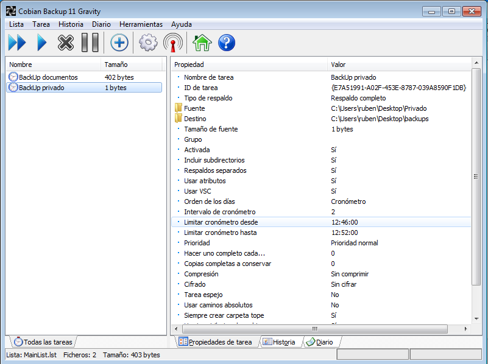
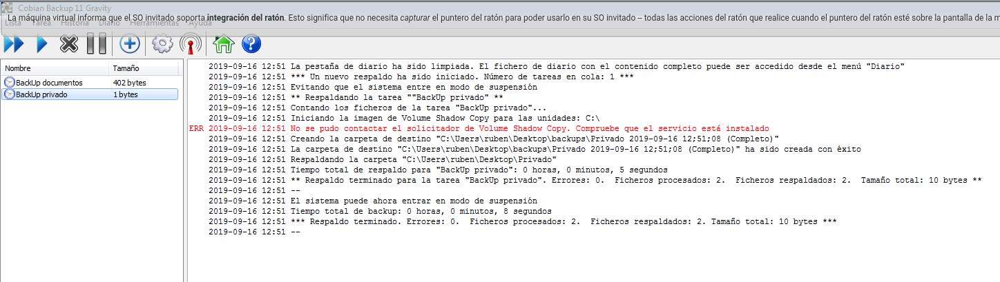
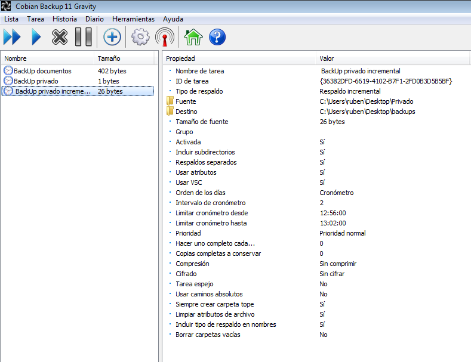
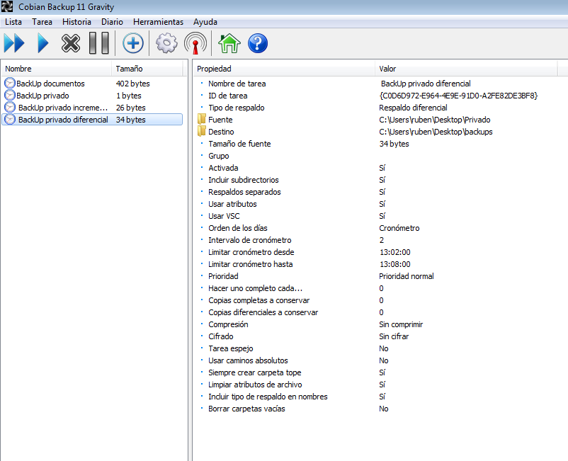
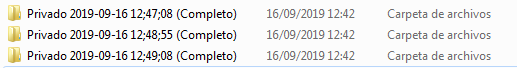
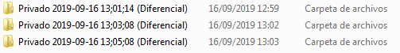

# **Cobian BackUp**

# **Enunciado:**

Una de las formas más habituales de salvaguardar la información es la realización de Backups. Algunos sistemas operativos proveen de soluciones para realizar estas acciones, aunque algo limitadas. Por este motivo, se suelen instalar aplicaciones que nos faciliten el trabajo y mejoren las prestaciones que los sistemas nos ofrecen.

Este es el caso del aplicativo Cobian Backup. Esta aplicación ha sido desarrollada por una única persona desde 1999 en su tiempo libre, y se ha asentado como una de las mejores referencias en aplicaciones para la realización de backups sencillos.

Utilizando esta aplicación, realizar las siguientes tareas:

  **1.-** Planificar un backup completo del directorio de datos (Documentos) del usuario que estamos utilizando. Programar dicho backup para realizarlo los Lunes y los Viernes a las 18:30, que es la hora que cierra la oficina.

  **2.-** Realizar un backup completo de un directorio creado en el escritorio del usuario, que tenga por nombre Privado. Debe realizarse esta tarea de forma que se realice, de forma automática, tres veces seguidas con una diferencia de dos minutos entre las tres (realizar cambios en los ficheros durante esos dos minutos para comprobar los efectos sobre el resultado del backup).

  **3.-** Realizar la misma tarea anterior pero utilizando el modo de backup incremental.

  **4.-** Realizar la misma tarea anterior pero utilizando el modo de backup diferencial.

  **5.-** Comparar los resultados de los tres métodos.

  **6.-** Realizar los procedimientos de recuperación de la información para los métodos incremental y diferencial.

# **Proceso:**

## **1.-** BackUp con fechas programadas.

Vamos a planificar una copia de seguridad del directorio "*Documentos*" para que se realice solo los Lunes y los Viernes a las 18:30.

## **2.-** BackUp completo

En este apartado vamos a programar un backup completo para que se realice tres veces con una diferencia de dos minutos entre cada copia automáticamente. La copia se hará de un directorio creado por nosotros mismos llamado “Privado”, en el cual haremos creando documentos de texto entre las copias de seguridad para que se noten las diferencias en cada copia.

## **3.-** BackUp incremental

En este apartado haremos lo mismo que en la práctica anterior, pero en lugar de realizar el backup en modo completo, lo haremos en modo incremental.

## **4.-** BackUp diferencial

Al igual que en el apartado anterior, este apartado será igual que el segundo, pero en modo diferencial.

## **5.-** Comprobaciones

El modo completo, guarda más cantidad de informacion que el resto de modos, por lo que las copias de seguridad resultante ocupa demasiado espacio comparado a los otros dos modos.

El modo incremental guarda solo los cambios realizados más recientemente. La ventaja del backup incremental es que copia una menor de cantidad de datos que un respaldo completo y ocupa menos espacio.

El modo diferencial copia todos los datos que hayan sido modificados desde el último respaldo realizado, por lo que ocupa más espacio que un backup incremental, pero menos que uno completo.

## **6.-** Procedimiento de recuperación

Para recuperar los datos que han sido copiados en los backups en caso de haber perdido los ficheros/datos originales, basta con dirigirnos la carpeta en la que se han guardado todas las copias de seguridad, seleccionar los datos deseados y pegarlos donde los queramos ubicar.
