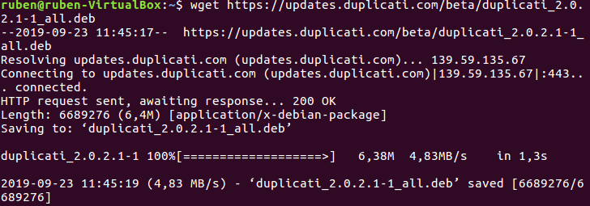
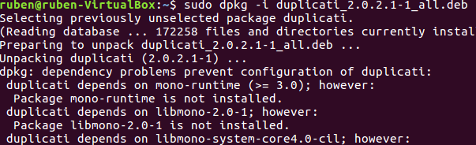
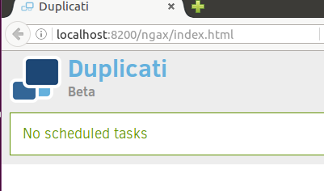
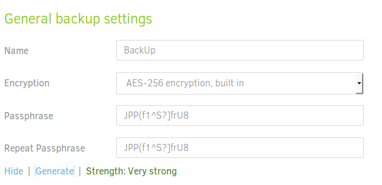
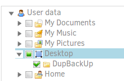
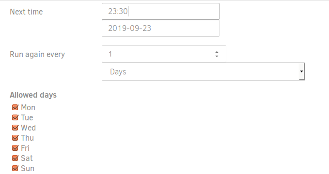

## **Copias de seguridad cifradas con DUPLICATI**

# **Enunciado**

DUPLICATI es un servicio opensource y multiplataforma  que nos permite realizar copias de seguridad en local y hacia la nube.

Utilizando esta aplicación, realizar las siguientes tareas:

  **1.-** Instalar la aplicación en Ubuntu

  **2.-** Crear en un servicio en la nube de nuestra elección la carpeta "DupBackUp"

  **3.-** Configurar en duplicati la realización de la copia de seguridad hace la carpeta que hemos creado en la nube, con las siguientes características:

    La copia debe ser incremental.
    La copia debe estar cifrada.

  **4.-** Planificar un backup completo del directorio de datos (Documentos) del usuario que estamos utilizando. Programar dicho backup para realizarlo todos los días a las 23:30

  **5.-** Realizar el  procedimiento de comprobación de la integridad de las copias realizadas y de recuperación de la la información.

# **Proceso**

## **1.-** Instalación de DUPLICATI

Nos disponemos a instalar la aplicación Duplicati mediante comandos por la terminal, para ello ejecutamos: wget https://updates.duplicati.com/beta/duplicati_2.0.2.1-1_all.deb

Tendremos que instalar también el software de respaldo, asi que ejecutamos el comando: sudo dpkg -i duplicati_2.0.2.1-1_all.deb

En caso de que al intentar lanzar el programa ejecutando duplicati en el terminal, deberemos instalar unos paquetes con el comando sudo apt-get install -f. A continuación escribimos en el terminal http://localhost:8200/ngax/index.html para comenzar a utilizar el Duplicati.

## **2.-** Creación y configuración del BackUp

Creamos en un servicio en la nube de nuestra elección la carpeta “DupBackUp”. Configurar la realización de la copia de seguridad para que se haga de modo incremental y que la copia esté cifrada.

Planificamos un backup completo del directorio Documentos y que se haga todos los días a las 23:30

Una vez se hayan realizado las copias de seguridad, podremos comprobar la integridad de las copias realizadas y la recuperación de entrega.
